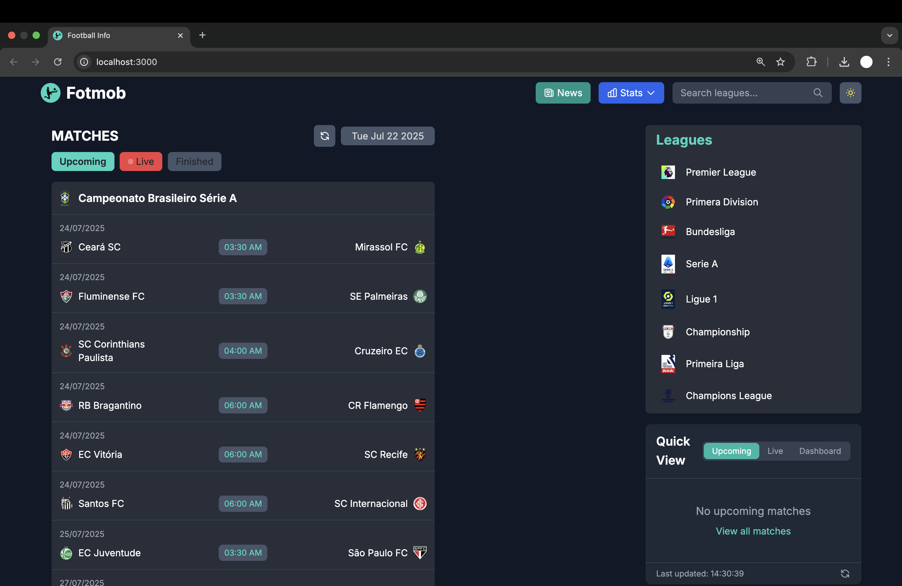
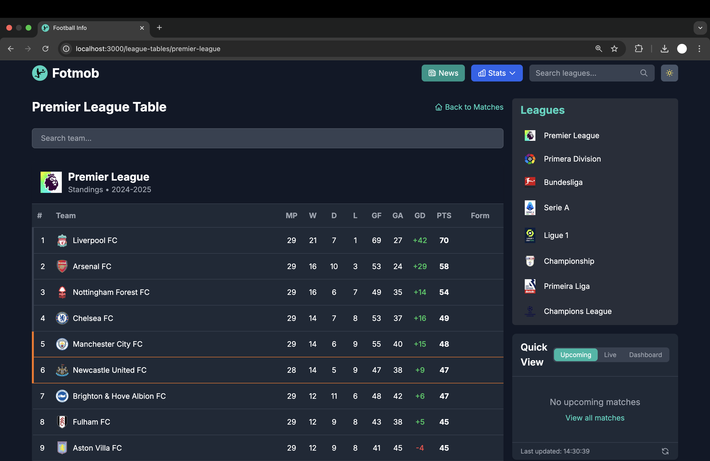
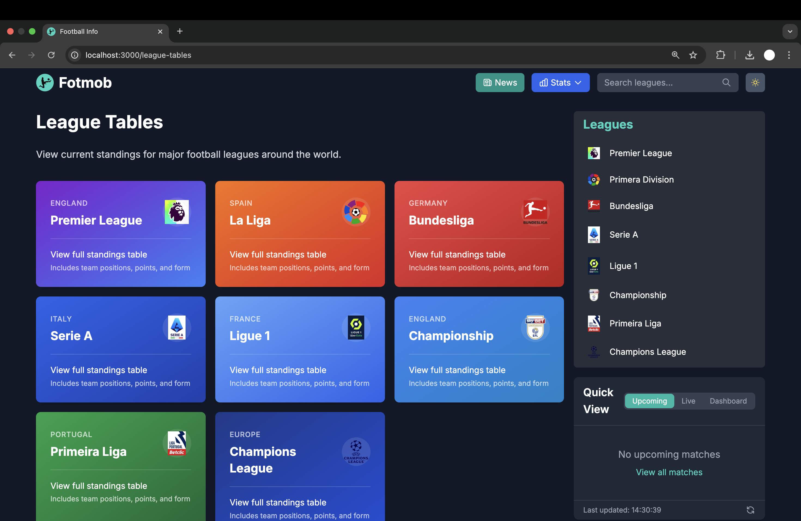
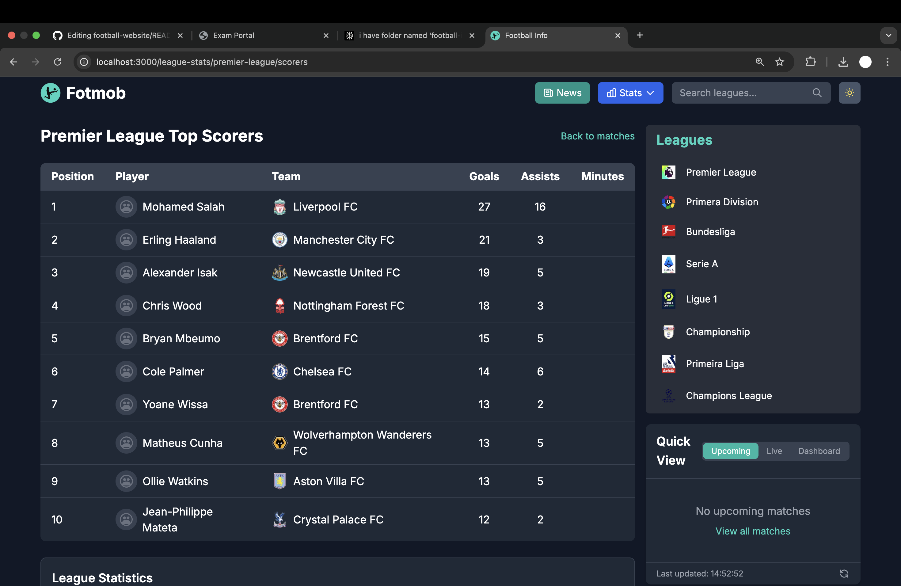

<h1>Football Info Website</h1>

<p>Welcome to the <strong>Football Info Website</strong> — your one-stop hub for all things football! This project delivers up-to-date match details, team stats, and player info in a clean, user-friendly interface designed for football fans, analysts, and data enthusiasts alike.</p>

<p>Built with modern web technologies, this site fetches and presents football match data seamlessly, aiming to make exploring fixtures, results, and stats both intuitive and enjoyable.</p>

<h2>Features</h2>
<ul>
  <li>Live and historical match info across major leagues</li>
  <li>Team and player statistics</li>
  <li>Responsive design for smooth use on any device</li>
  <li>Clean, minimal UI for fast browsing</li>
</ul>

<p>Whether you're tracking your favorite team or diving into football data analysis, this website makes the beautiful game’s stats easy to access and understand.</p>

<h3><em>Future Plan : </em> Use Machine Learning models to predict live and upcoming matches.</h3>

## Getting Started

clone this repository and run the development server:

```bash
npm run dev
# or
yarn dev
# or
pnpm dev
```

## 🚀 Live Demo
Explore the app live: [Click here to launch fotmob💻](https://football-info-matches.vercel.app/)

## Preview


<p float="left">
  
  
  
  
</p>
